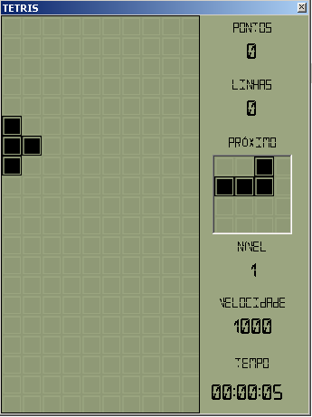

# Tetris

Tetris é um jogo comercializado pela Nintendo em 1989 e um dos jogos de vídeo-game mais famosos de todos os tempos.

Essa versão foi inicialmente inspirada nos brick-games e foi desenvolvido com propósito único de estudo e prática das disciplinas de Engenharia de Software.

O projeto utiliza o jogo Tetris como cenário justamente por ser muito conhecido, o que facilita a correlação das regras no mundo real com os códigos que aqui são escritos.

## História

Em 1984, no Centro de Computação da Academia de Ciências Soviética, o matemático russo Alexey Pajintov estudava uma teoria de análise combinatória dos pentaminós de Solomon Golomb. Os pentaminós eram peças compostas por cinco blocos, que poderiam alterar sua forma para combinarem entre si. Pajintov criou sua versão simplificada da teoria criando peças de 4 blocos, os tetraminós. 

Em junho de 1984, ele adaptou sua teoria para um jogo que se tornou rapidamente muito popular e posteriormente descoberto pelo inglês Robert Stein, quem o trouxe para o ocidente onde despertou interesse da Nintendo.

Ao longo dos anos a distribuição desse jogo se tornou objeto de disputas judiciais complexas que envolviam três países e as principais fabricantes de jogos da época, no entanto, a Nintendo conseguiu ganhar a briga e tornou o Tetris o seu jogo de lançamento do Game Boy em 1989, no lugar do principal mascote da casa, Mario.

A versão do Gameboy vendeu 70 milhões de cópias e o jogo entrou para o Guiness Book por ter sido o mais portado da história, sendo distribuído em 65 plataformas diferentes.

Por ter sido desenvolvido em uma estatal russa por um cidadão russo, os diretos pela comercialização do jogo foram retidos pelo Estado durante 10 anos, e Alexey só passou receber royalties à partir de 1996.

...

Um fato curioso é que Steve Wozniak, cofundador da Apple foi um dos maiores recordistas do jogo e enviada suas pontuações para a revista Nintendo Power. Ele passou a ser barrado pela revista depos de um tempo, mas continuou mandando seus recordes usando um nome falso, Evets Kainzow, que significa Steve Wozniak ao contrário.

## Arquitetura

  O propósito deste projeto é simplificar a aplicação das métodologias, padrões e princípios em destaque atualmente. Toda implementação leva em consideração as boas práticas do Clean Code, Design Patterns e princípios como SOLID, mas com a preocupação de se evitar o over-engineering. Então mesmo que algum padrão possa ser aplicado, ainda será avaliado seu custo benefício. O projeto sempre estará aberto a refatoração.

  A Solution inicial é composta por somente dois pacotes principais, o Core e o Desktop.
O Core é tem responsabilidades transversais, ele provém o Modelo de Domínio e os Acessos a Dados. 

O projeto Desktop contém as IHC, como parte da camada de Interfaces, aqui fornecendo interface para usuários desktop Windows. Sua preocupação se limita em lidar com as entradas vindas dos dispositivos e fornecer respostas visuais amigáveis à um cliente humano.

  Enquanto eu modelava o Modelo de Domínio, a neutralidade tecnológica e o desacoplamento das responsabilidades foi algo fundamental, por isso o Domínio não tem ligações externas com camadas de Infraestrutura ou Interface por exemplo. Afinal, não podemos permitir que regras do jogo sejam manipuladas pelo usuário, e nem ficar preso num modelo de Interface só. Provavelmente teremos versões para outros dispositivos de IHC, como Mobile por exemplo. No entanto, não isolei o Domain Model em uma DLL à parte (simplesmente porque não faz nenhum sentido pra mim fazer isso nesse projeto), mas isolei todas as classes, métodos e propriedades que precisavam simplesmente usando operadores de visibilidade *Internal* e *Private*.

## Características

- **Tema Clássico**: Opção para selecionar o tema similar ao do jogo original da década de 80.
- **Tema Brickgame**: Opção para selecionar o tema similar ao do video-game de bolso, famoso na década de 90.
- **Slide**: Segurar a tecla CTRL enquanto move a peça para esquerda ou direita acelera a velocidade do movimento.
- **Smash Down**: Ao apertar a tecla SPACEBAR a peça imediatamente cai em velocidade acelerada.
- **Sons**: Os eventos e movimentos reproduzem sons similares aos dos brickgames.
- **Sound On/Off**: Opção para ligar ou desligar sons na tela inicial ou durante o jogo pressionando a tecla SHIFT.
- **Pontuação**:
  + 1 linha completa vale 40 pontos
  + 2 linhas completas na mesma jogada valem 100 pontos
  + 3 linhas completas na mesma jogada valem 300 pontos
  + TETRIS (4 linhas completas na mesma jogada) vale 1.200 pontos

## Gráfico

## Conclusão

Quando desenvolvi esse jogo tive como meta não procurar outros projetos como exemplo. 
Procurei apenas informações sobre as regras e termos. Eu queria fazê-lo por completo sem auxílio técnico, desse modo eu acreditava que poderia tornar meu estudo mais neutro, podendo chegar numa conclusão embasada na teoria e na minha prática, não influenciada.

Na sequência vou destacar minha conclusão em cada um dos campos de estudo.

### Domain-Driven Design

Apesar de ser um contexto relativamente pequeno, o uso de DDD me ajudou criar um modelo de domínio conciso. O desenvolvimento partiu todo dele, o entendimento das regras, à quem elas pertenciam, quais eram realmente as entidades do domínio, como elas se relacionavam, onde e quando deveria ser implementadas as regras, o sistema cresceu ao redor do domínio, e isso me permitiu fazê-lo em duas semanas. Porque não houve um momento onde me questionei se estava fazendo certo ou se havia esquecido de algo. O domínio me pareceu maduro e me apoiou ao longo do desenvolvimento. 

Também percebi bastante segurança ao longo do desenvolvimento graças à tentativa desde o início de adotar a linguagem ubíqua, isso me ajudou entender melhor o problema e aprender durante o desenvolvimento, a clareza da linguagem me permitiu elaborar melhores perguntas e me sentir mais preparado para entender as respostas e replicar enquanto não desse liga.

### Windows Forms

A escolha de uma tecnologia não tão popular atualmente foi proposital, justamente para servir como uma base para versões futuras de diferentes interfaces gráficas.

Essa versão deveria ser concluída rápido, o Windows Forms ajudou por permitir trabalhar facilmente com callbacks através de Eventos e delegates.

O projeto ficou bem leve e pequeno para download, graças ao .Net Framework que já possui várias bibliotecas embutidas.

### Clean Code

Depois que terminei a primeira versão, achei vários exemplos de outras implementações desenvolvidas com projetos mais simples. 

Em geral, a lógica de solução me pareceu semelhante, porém, alguns desses projetos me pareceram mais difíceis de dar manutenção. 
Alguns estavam escritos em apenas uma classe ou método, você pode não se assustar quando vê a estrutura, mas acaba assustando quando abre esse arquivo.
Muitos abusavam de desvios condicionais e loops, gerando uma complexidade ciclomática muito alta. 
O uso de números mágicos e comentários também foram coisas que não quis fazer aqui.

No final me parece que talvez colocar todos os arquivos do meu projeto em apenas 1 arquivo é mais fácil do que separar um arquivo só em vários outros quando precisar dar manutenção.

### SOLID

No final minha conclusão foi que usar princípios SOLID nesse projeto o deixou mais fácil de manter e evoluir do que os outros que vi e que pareciam mais eficientes por conter menos arquivos ou métodos.

Na aplicação cliente, eu implementei o padrão command para permitir extensão de comandos respeitando OCP do SOLID.

### Design Patterns

Usei por exemplo o padrão State para garantir por exemplo, que um jogo em andamento pode ser pausado e continuado.

Também foi usado o padrão Builder para tornar a construção de uma peça mais dinâmica em tempo de execução.

Para montagem dos tetraminós usei o padrão Strategy, pois, o formato de cada peça é diferente além do comportamento de rotação e isso é definido em tempo de execução.

Para persistência dos dados usei o padrão Repository, onde eu tenho um interface no Modelo de Domínio e uma implementação fora dele. No meu caso aqui a implementação é quase um Mock para salvar em formato flat no disco local, mas poderia facimente ser extendido para um modelo em núvem por exemplo.

Na aplicação cliente, eu implementei o padrão command para permitir extensão de comandos respeitando OCP do SOLID.

## Links úteis

- [Baixar](https://github.com/phduarte/Tetris/releases/latest)
- [Documentação](https://github.com/phduarte/Tetris/wiki)

## Bibliografia

- https://www.historiadomundo.com.br/idade-contemporanea/origem-do-tetris.htm#:~:text=Considerado%20um%20verdadeiro%20cl%C3%A1ssico%20dos,matem%C3%A1tico%20norte%2Damericano%20Solomon%20Golomb.
- https://tecnoblog.net/meiobit/289280/tetris-30-anos-a-historia/
